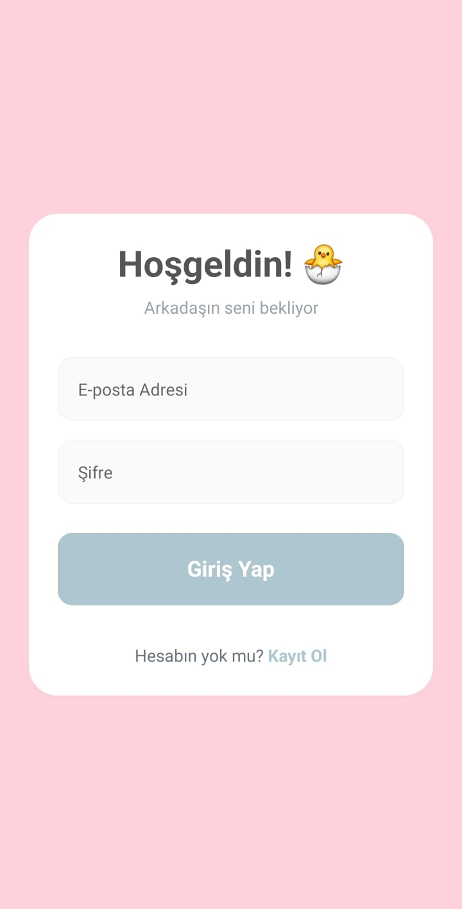
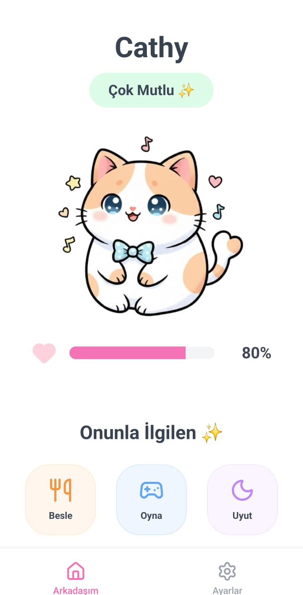
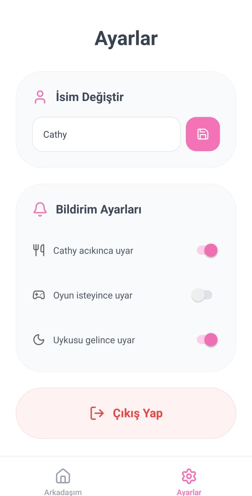

# kawaii-friend

A charming virtual companion simulator built with React Native (Expo), TypeScript, NativeWind, and Firebase. Features real-time state management, authentication, and push notifications.

# 🌸 Kawaii Friend Simulator

> A virtual companion application where you create, care for, and interact with your digital friend. Built with **Expo** and **Firebase**.


## 📱 Project Overview

This project is a mobile application assignment designed to demonstrate state management, authentication, and cloud integration in a real-world scenario. Users can sign up, create a unique digital friend, and manage their friend's state (Hungry, Tired, Happy, Bored) through interactive actions.

### 🎯 Key Features

- **Authentication:** Secure Email/Password login using Firebase Auth.
- **Real-time Database:** Friend status and history saved instantly to Firestore.
- **Interactive States:** Actions like "Feed", "Play", and "Rest" directly impact the character's mood.
- **Push Notifications:** Local notifications via Expo Notifications (e.g., "Your friend misses you!").
- **Modern UI:** Styled with **NativeWind** (Tailwind CSS) for a pastel, kawaii aesthetic.
- **Navigation:** Smooth transitions using Bottom Tab Navigation.

---

## 📸 Screenshots

_(Add your screenshots here later)_

|               Home Screen               |                   Interaction                    |                    Settings                     |
| :-------------------------------------: | :----------------------------------------------: | :---------------------------------------------: |
|  |  |  |

---

## 🛠️ Tech Stack

- **Core:** React Native (Expo Managed Workflow)
- **Language:** TypeScript
- **Styling:** NativeWind (Tailwind CSS)
- **Backend:** Firebase (Authentication & Firestore)
- **Navigation:** Expo Router / React Navigation
- **Notifications:** Expo Notifications

---

## 🚀 Installation & Setup

Follow these steps to run the project locally:

1.  **Clone the repository:**

    ```bash
    git clone https://github.com/coskunic/kawaii-friend.git
    cd kawaii-friend
    ```

2.  **Install dependencies:**

    ```bash
    npm install
    ```

3.  **Firebase Configuration:**

    - Create a project at [Firebase Console](https://console.firebase.google.com/).
    - Enable **Authentication** (Email/Password).
    - Create a **Firestore Database**.
    - Copy your web configuration keys into `src/config/firebase.ts`.

4.  **Run the app:**

    ```bash
    npx expo start -c
    ```

5.  **Scan the QR Code:**
    - Use the **Expo Go** app on your Android/iOS device or run on an emulator.

---

## 📂 Project Structure

KAWAIIFRIEND/
├── assets/
│ ├── images/ # Cat mood illustrations
│ ├── screenshots/ # App preview images
│ └── icon.png # App icons & splash
├── src/
│ ├── components/ # CustomAlert, InteractionButton
│ ├── config/ # firebase.ts
│ ├── navigation/ # MainTab & Root Navigators
│ ├── screens/ # Home, Login, Register, Settings
│ ├── types/ # TypeScript interfaces (index.ts)
│ └── utils/ # notifications.ts
├── App.tsx # Application entry point
├── app.json # Expo configuration
├── tailwind.config.js # Styling configuration
└── README.md # Documentation

## 📝 License

This project is for educational purposes.
